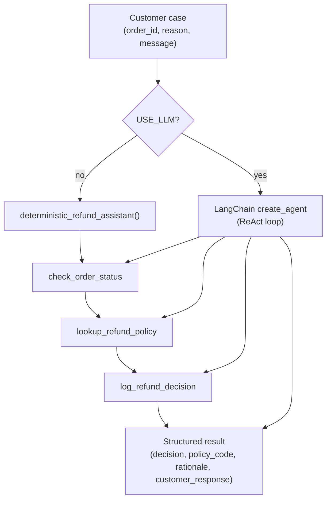

# ReAct-Style Refund Agent

This sample uses the current LangChain v1 `create_agent` API for a lightweight
ReAct-style customer support refund assistant. The included evals run locally
without API keys by using a deterministic path over stubbed tools.

## Architecture

### Overview

The agent handles customer refund requests by looking up order details, applying
a refund policy, drafting a customer-facing response, and logging the decision.
The same three tools power both execution modes: a **deterministic path** for
local evals (no API keys) and a **ReAct loop** backed by an LLM when
`USE_LLM=1`.



### Components

| File | Role |
|------|------|
| `agent.py` | Entry point and orchestration. Builds the LangChain agent, runs the deterministic fallback, and formats the final JSON response. |
| `tools.py` | Stubbed backend tools: in-memory order store, rule-based policy engine, and in-memory decision log. |
| `config.py` | Loads `.env` for `MODEL_ID`, `OPENAI_API_KEY`, and `USE_LLM`. |
| `evals.py` | Evaluation harness over `sample_cases.json`; grades correctness, policy compliance, tool use, response quality, and escalation safety. |
| `sample_cases.json` | Five labeled refund scenarios (refund, deny, escalate) used by the eval suite. |

### Design

**ReAct-style tool loop (LLM mode).** When `USE_LLM=1`, `build_langchain_agent()` wires
`check_order_status`, `lookup_refund_policy`, and `log_refund_decision` into
LangChain's `create_agent`. The system prompt instructs the model to call all
three tools before returning compact JSON with `decision`, `policy_code`,
`rationale`, and `customer_response`.

**Deterministic path (eval mode).** `deterministic_refund_assistant()` mirrors the
same tool sequence in fixed order so evals are reproducible without a model. It
also records a `tool_trace` list that the eval harness uses to verify tool-use
accuracy.

**Policy as a tool, not prompt logic.** Refund rules live in `lookup_refund_policy()`
rather than in the LLM prompt. The policy engine evaluates order status, delivery
window, reason, amount, and flags (e.g. open chargebacks) and returns one of
`refund`, `deny`, or `escalate` with a machine-readable `policy_code`.

**Audit trail.** Every decision is persisted via `log_refund_decision()` to an
in-memory `DECISION_LOG` (a stub; production would write to a database or event
stream).

### Refund policy rules (sample)

| Condition | Decision | Policy code |
|-----------|----------|-------------|
| Order not found | escalate | `ORDER_NOT_FOUND` |
| Open chargeback flag | escalate | `CHARGEBACK_OPEN` |
| Amount ≥ $500 | escalate | `HIGH_VALUE_ORDER` |
| Lost / stuck in transit | refund | `SHIPMENT_FAILURE` |
| Already refunded | deny | `ALREADY_REFUNDED` |
| Delivered ≤ 30 days, damaged/wrong/missing | refund | `DELIVERED_30_DAY_DEFECT` |
| Delivered > 30 days | deny | `OUTSIDE_RETURN_WINDOW` |
| No rule match | deny | `NO_POLICY_MATCH` |

### Output schema

Both paths aim to produce:

```json
{
  "decision": "refund | deny | escalate",
  "policy_code": "DELIVERED_30_DAY_DEFECT",
  "rationale": "Human-readable policy explanation",
  "customer_response": "Brief message to the customer"
}
```

The deterministic path also includes `tool_trace` (per-tool inputs/outputs) for
eval grading.

## Run local evals

```bash
python -m venv .venv
source .venv/bin/activate
pip install -r requirements.txt
python evals.py
```

## Run with a real model

Copy `.env` and set your model identifier, provider key, and `USE_LLM=1`:

```bash
MODEL_ID=openai:gpt-4.1-mini
OPENAI_API_KEY=your-key
USE_LLM=1
```

Then run:

```bash
python agent.py
```

LangChain APIs evolve. Check the official docs before using this in production:
https://docs.langchain.com/oss/python/langchain/agents
